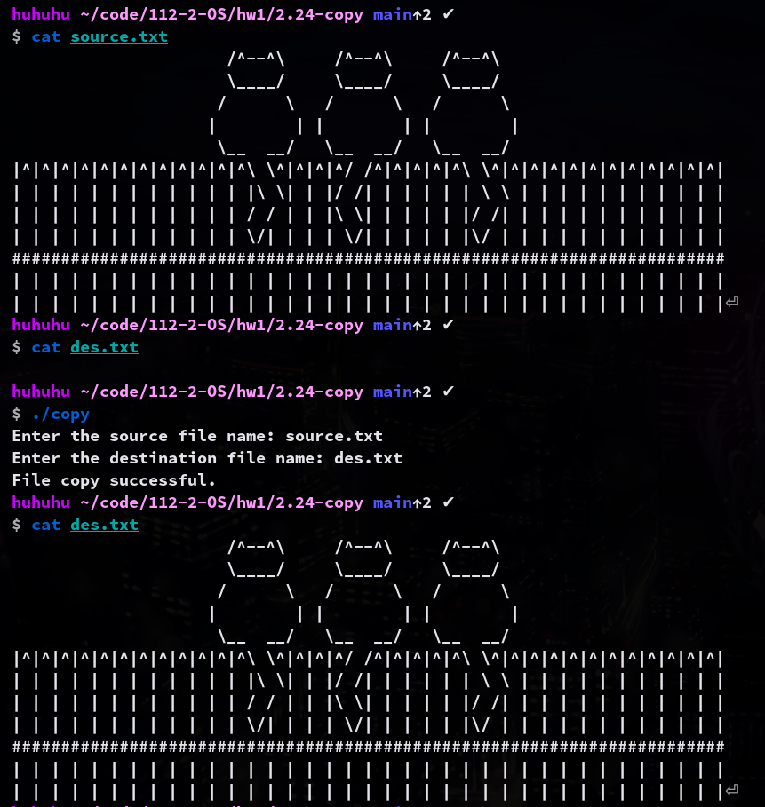
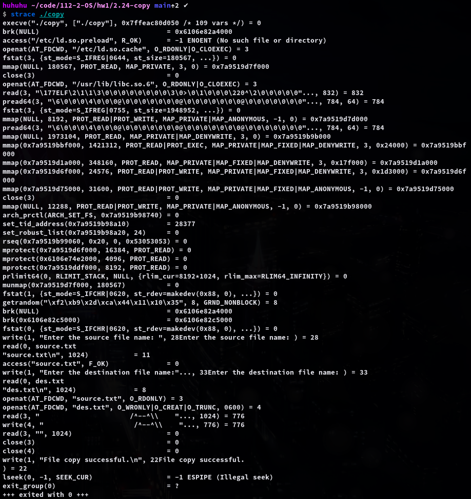

## 2.24

In Sec.2.3, we described a program that copies the contents of one file to a destination file.
* This program works by first prompting the user for the name of the source and destination files.

Write this program using either POSIX or Windows API.
* Be sure to include all necessary error checking, including ensuring that the source file exists.

Once you have correctly designed and tested the program, if you used a system that supports it, run the program using a utility that traces system calls. (Assume the name of the executable file is FileCopy)
* Linux systems provide the strace utility
  * (strace ./FileCopy)
* Solaris and Mac OS X systems use the dtrace command
  * (sudo dtrace ./FileCopy)
* As Windows systems do not provide such features, you will have to trace through the Windows version of this program using a debugger.

### compilation
```sh
gcc copy.c -o copy
```

### usage
```
./copy
```
If source file doesn't exist, it will occrurs an error.
If destination file doesn't exist, it will create one.



### strace

