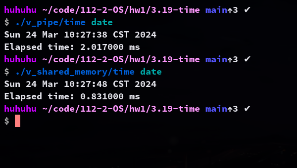

## 3.19

Write a C program called time.c that determines the amount of time necessary to run a command from the command line.

This program will be run as "./time <command>" and will report the amount of elapsed time to run the specified command.

This will involve using fork() and exec() functions, as well as the gettimeofday() function to determine the elapsed time.

It will also require the use of two different IPC mechanisms.

The first version will have the child process write the starting time to a region of shared memory before it calls exec().
* After the child process terminates, the parent will read the starting time from shared memory.
* Refer to Section 3.7.1 for details using POSIX shared memory.

The second version will use a pipe.
* The child will write the starting time to the pipe, and the parent will read from it following the termination of the child process.

### compilation
```sh
gcc time.c -o time
```

### usage
```
./time <command>
```


