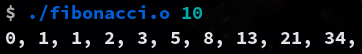
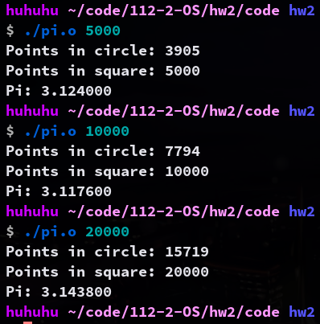

# 4.27

Write a multithreaded program that generates the Fibonacci sequence.

This program should work as follows: On the command line, the user will enter the number of Fibonacci numbers that the program is to generate. The program will then create a separate thread that will generate the Fibonacci numbers, placing the sequence in data that is shared by the threads (an array is probably the most convenient data structure). When the thread finishes execution, the parent thread will output the sequence generated by the child thread. Because the parent thread cannot begin outputting the Fibonacci sequence until the child thread finishes, the parent thread will have to wait for the child thread to finish.

### Compilation
```sh
make n=fibonacci
```

### Usage
```sh
./fibonacci.o <number>
```

### Example Output
```sh
$ ./fibonacci.o 10
0, 1, 1, 2, 3, 5, 8, 13, 21, 34,
```



# 4.24

Write a multithreaded version of this algorithm that creates a separate thread to generate a number of random points.

The thread will compute the number of points that fall within the circle and store that result in a global variable. When this thread has exited, the parent thread will calculate and output the estimated value of π. It is worth experimenting with the number of random points generated to see how accurate the estimation of π can be.

### Compilation
```sh
make n=pi
```

### Usage
```sh
./pi.o <number of points>
```

### Example Output
```sh
$ ./pi.o 20000
Points in circle: 15707
Points in square: 20000
Pi: 3.141400
```

