### 4.8: Provide two programming examples in which multithreading does not provide better performance than a single-threaded solution.

1. simple program: If the workload to be performed by the individual threads is small, the overhead of context-switching can outweigh any performance benefits of a multi-threaded solution.
2. sequencial data dependency: If the multiple threads are sequentially dependent on each other, there will be no performance benefit to multi-threading.

### 4.10: Which of the following components of program state are shared across threads in a multithreaded process?
#### (a) Register values
#### (b) Heap memory
#### (c\) Global variables
#### (d) Stack memory

(b), (c\)

### 4.16: A system with two dual-core processors has four processors available for scheduling
* A CPU-intensive application is running on this system
* All input is performed at program start-up, when a single file must be opened
* Similarly, all output is performed just before the program terminates, when the program results must be written to a single file
* Between start-up and termination, the program is entirely CPU-bound
* Your task is to improve the performance of this application by multithreading it
* The application runs on a system that uses the one-to-one threading model (each user thread maps to a kernel thread)

### How many threads will you create to perform the input and output? Explain

One. The file should be accessed sequentially or it may caused race condition.

### How many threads will you create for the CPU-intensive portion of the application? Explain.

Four. Since the thread is one-to-one mapping, four processors indicates that there are at most four threads can run parallelism.

### 5.14: Most scheduling algorithms maintain a run queue, which lists processes eligible to run on a processor. On multicore systems, there are two general options:
#### (1) each processing core has its own run queue, or
#### (2) a single run queue is shared by all processing cores.
#### What are the advantages and disadvantages of each of these approaches?

(1) 
advantages: no race condition will happen on a single run queue
disadvantages: hard to schedule all processes to different queue

(2) 
advantages: easy to manage processes
disadvantages: there might be race condition since multiple threads have to access the same queue

### 5.18: The following processes are being scheduled using a preemptive, priority-based, round-robin scheduling algorithm.
* Each process is assigned a numerical priority, with a higher number indicating a higher relative priority.
* For processes with the same priority, a round-robin scheduler will be used with a time quantum of 10 units.
* If a process is preempted by a higher-priority process, the preempted process is placed at the end of the queue

| Thread | Priority | Burst | Arrival |
| -- | -- | -- | -- |
| P1 | 8  | 15 |  0 |
| P2 | 3  | 20 |  0 |
| P3 | 4  | 20 | 20 |
| P4 | 4  | 20 | 25 |
| P5 | 5  |  5 | 45 |
| P6 | 10 | 15 | 55 |

#### (a) Show the scheduling order of the processes using a Gantt chart.

```mermaid
gantt
    title chart
    dateFormat X
    axisFormat %s
    section p1
    p1   : 0, 15
    section p2
    p2   : 15, 25
    p2   : 85, 95
    section p3
    p3   : 25, 35
    p3   : 50, 60
    section p4
    p4   : 35, 45
    p4   : 75, 85
    section p5
    p5   : 45, 50
    section p6
    p6   : 60, 75
```

#### (b) What is the turnaround time for each process?

p1 = 15
p2 = 70
p3 = 35
p4 = 50
p5 = 5
p6 = 15

#### (c\) What is the waiting time for each process?

p1 = 0
p2 = 50
p3 = 15
p4 = 30
p5 = 0
p6 = 0

### 5.22: Consider a system running ten I/O-bound tasks and one CPU-bound task. Assume that the I/O-bound tasks issue an I/O operation once for every millisecond of CPU computing and that each I/O operation takes 10 milliseconds to complete. Also assume that the context-switching overhead is 0.1 millisecond and that all processes are long-running tasks. Describe the CPU utilization for a round-robin scheduler when:

#### (a) The time quantum is 1 millisecond

11 / (11 + 1.1) = 91%

#### (b) The time quantum is 10 millisecond

20 / (20 + 1.1) = 94%

### 5.25: Explain the differences in how much the following scheduling algorithms discriminate in favor of short processes:

#### (a) FCFS

If a short process arrive after of a long process, it have to wait for a long time until the long process is done.

#### (b) RR

Round-Robin treats all process equally, no process will wait longer than (n-1)\*(time quantum) of time.
But if the time quantum is very long, it will cause the same result as FCFS.

#### (c\) Multilevel feedback queues

Multilevel feedback queue scheduling is more adaptive and dynamic compared to FCFS and RR, since each queue have different strategy.

### 6.7: The pseudocode of Figure 6.15 illustrates the basic push() and pop() operations of an array-based stack. Assuming that this algorithm could be used in a concurrent environment, answer the following questions:

#### (a) What data have a race condition?

top

#### (b) How could the race condition be fixed?

Let `pop` and `push` function be critical section, only one process can access the function.

### 6.15: Explain why implementing synchronization primitives by disabling interrupts is not appropriate in a single-processor system if the synchronization primitives are to be used in user-level programs.

For security consideration, it is very dangerous if user-level program can disable interrupt, since the process might be last very long.

### 6.18: The implementation of mutex locks provided in Section 6.5 suffers from busy waiting. Describe what changes would be necessary so that a process waiting to acquire a mutex lock would be blocked and placed into a waiting queue until the lock became available

1. Modify Mutex Structure
    * Including waiting queue in mutex structure
1. Implement Blocking
    * When a process attempt to acquire a lock, the process will be placed into a waiting queue.
2. Release Lock
    * When a lock is released, dequeue the process