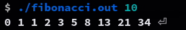
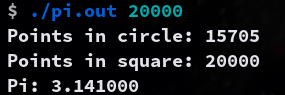
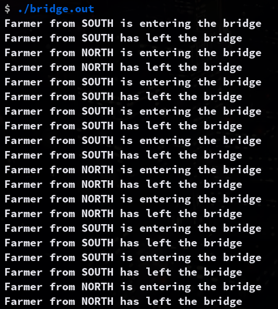
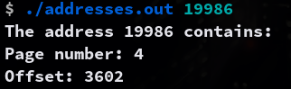

# 7.15
In Exercise 4.27, you wrote a program to generate the Fibonacci sequence. If we let the parent thread access the Fibonacci numbers as soon as they were computed by the child thread—rather than waiting for the child thread to terminate— what changes would be necessary to the solution for this exercise? Implement your modified solution. 

### Solution

The child thread will write the Fibonacci numbers to a shared buffer. The parent thread will read the numbers from the buffer as soon as they are written by the child thread. 

### Compilation
```sh
make n=fibonacci
```

### Usage
```sh
./fibonacci.out <number>
```

### Example Output
```sh
$ ./fibonacci.out 10
0 1 1 2 3 5 8 13 21 34
```


# 7.17
Exercise 4.24 asked you to design a multithreaded program that estimated π using the Monte Carlo technique. Modify that program so that you create several threads, each of which generates random points and determines if the points fall within the circle. Each thread will have to update the global count of all points that fall within the circle. Protect against race conditions on updates to the shared global variable by using mutex locks.

### Compilation
Make sure your compiler supports `openmp` library.
```sh
make n=pi
```

### Usage
```sh
./pi.out <number of points>
```

### Example Output
```sh
./pi.out 20000
Points in circle: 15705
Points in square: 20000
Pi: 3.141000
```


# 8.32
Implement your solution to Exercise 8.30 using POSIX synchronization. n particular, represent northbound and southbound farmers as separate threads. Once a farmer is on the bridge, the associated thread will sleep for a random period of time, representing traveling across the bridge. Design your program so that you can create several threads representing the northbound and southbound farmers.

### Compilation
```sh
make n=bridge
```

### Usage
```sh
./bridge.out
```

### Example Output
```sh
$ ./bridge.out
Farmer from SOUTH is entering the bridge
Farmer from SOUTH has left the bridge
Farmer from NORTH is entering the bridge
Farmer from NORTH has left the bridge
Farmer from SOUTH is entering the bridge
Farmer from SOUTH has left the bridge
Farmer from SOUTH is entering the bridge
Farmer from SOUTH has left the bridge
Farmer from SOUTH is entering the bridge
Farmer from SOUTH has left the bridge
Farmer from NORTH is entering the bridge
Farmer from NORTH has left the bridge
Farmer from NORTH is entering the bridge
Farmer from NORTH has left the bridge
Farmer from SOUTH is entering the bridge
Farmer from SOUTH has left the bridge
Farmer from SOUTH is entering the bridge
Farmer from SOUTH has left the bridge
Farmer from NORTH is entering the bridge
Farmer from NORTH has left the bridge
```


# 9.28 
Assume that a system has a 32-bit virtual address with a 4-KB page size. Write a C program that is passed a virtual address (in decimal) on the command line and have it output the page number and offset for the given address.

### Compilation
```sh
make n=addresses
```

### Usage
```sh
./addresses.out <address>
```

### Example Output
```sh
$ ./addresses.out 19986
The address 19986 contains:
Page Number = 4
Offset = 3602
```
