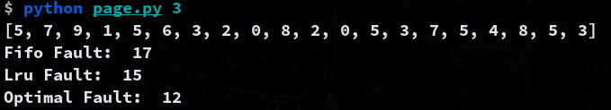
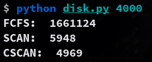

### 10.44:
Write a program that implements the FIFO, LRU, and optimal (OPT) page-replacement algorithms presented in Sec.10.4.
- Have your program initially generate a random page-reference string where page numbers range from 0 to 9.
- Apply the random page-reference string to each algorithm, and record the number of page faults incurred by each algorithm.
- Pass the number of page frames to the program at startup.
- You may implement this program in any programming language of your choice.

### Usage
```bash
python3 page.py <frame_size>
```

### Example
```bash
$ python page.py 3
[5, 7, 9, 1, 5, 6, 3, 2, 0, 8, 2, 0, 5, 3, 7, 5, 4, 8, 5, 3]
Fifo Fault: 17
Lru Fault: 15
Optimal Fault: 12
```


### 11.27:
Write a program that implements the following disk-scheduling algorithms:
- (a) FCFS
- (b) SCAN
- (c\) C-SCAN

Your program will service a disk with 5,000 cylinders numbered 0 to 4,999. The program will generate a random series of 1,000 cylinder requests and service them according to each of the algorithms listed above. The program will be passed the initial position of the disk head (as a parameter on the command line) and report the total amount of head movement required by each algorithm.

### Usage
```bash
python3 disk.py <initial_head_position>
```

### Example
```bash
$ python disk.py 4000
FCFS:  1661124
SCAN:  5948
CSCAN:  4969
```

